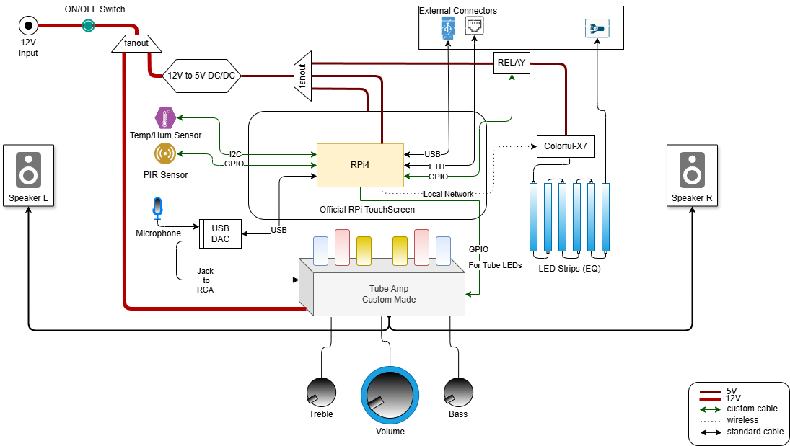

# Disclaimer #

#### This "project" is made without any pre-planning so it is sort of things (python scripts) added on top of each other to make the whole thing work! 
#### The MusicStation project started as very small script to control volumio with vocal commands then it evolved to what you have now. 
#### You may notice some inconsistencies in the scripts, that's due to the fact that some things were added later on on top of the original script.


# MusicStation (For VolumioOS)


A RaspberryPi 4 powered simple yet smart music station.


## System Overview
#### Architecture



#### Used Hardware

You can use the minimal harware required to replicate the MusicStation

##### Minimal
- Raspberry Pi 4:
  minimum 4Gb.
- A Touch Screen:
  Official Raspberry Pi touch screen was used.
- A USB DAC:
  Any cheap usb based Dac should work.
- A microphone (Any jack or usb microphone)
- An amplifier:
  I used a custom made Tube Amplifier that I made a couple of years ago. Unfortunately I lost the schematics to it...
  But any amplifier should work fine with the setup
- Passive speakers
- Power supply (12VDC)

##### Optional
- 12V to 5V DC step down convertor:
  This is **necessary** if a 12V amplifier is used otherwise you can power the system with a 5V DC power suuply. Just make sure that it can provide enough Amps to power up all the parts (specially the LED controller if used).
- Pir Sensor (presence detection)
- AHT20 Humidity and temperature sensor
- Colorful-X7 music controller
- WS2812b led strip (or something similar)
- 5VDC Relay
- Cables for external connectors (USB male to female, Ethernet male to female and any 3 pins connector for external LED strips)

**You can build any system of your choice as long as the minimal hardware requirements are met. No need to follow my setup.**
**If any help is needed building the system, please feel free to reach out.***


## Installation
#### Downlaod and install Volumio OS on your Raspberry pi 4

https://volumio.com/get-started/


#### Install Touch Display plugin on Volumio OS

Follow the instructions here:

https://developers.volumio.com/plugins/plugins-overview

#### Connect to the unit (using ssh)

https://developers.volumio.com/SSH%20Connection

#### Navigate to home directory

```bash
  cd
```

#### Download the install script

```bash
  wget 'https://raw.githubusercontent.com/CheAhMeD/MusicStation/refs/heads/main/install.sh?token=GHSAT0AAAAAAC3Q7ZNVGPYC3ZZHUT2HJA5CZ2S36HQ' -O install.sh
```

#### Install MusicStation with the provided script

```bash
  sudo ./install.sh
```

#### (Optional) When prompted accept running tinytuya wizard

*!!!This step is only required if you have a [Colorful-X7](https://www.superlightingled.com/colorful-x7-mini-smart-wifi-addressable-rgb-led-music-controller-p-6494.html) device in your installation!!!*
Follow the steps in install.sh file and make sure you accepted to run the last step (tinytuya wizard).
if not run:
```bash
  sudo python3 -m tinytuya wizard
```
More info: https://github.com/jasonacox/tinytuya?tab=readme-ov-file#setup-wizard---getting-local-keys

## Deployment

To deploy MusicStation 
- Make sure you have the required API keys.
- Copy and paste the keys in the file settings.py
```python
  # To change accordingly
  weather_key  = "OpenWeather_API_KEY_GOES_HERE"  # https://openweathermap.org/api
  weather_city = "OpenWeather_CITY_GOES_HERE"     # format "City,COUNTRYCODE" eg : "Gent,BE"
  open_ai_key  = "OpenAI_API_KEY_GOES_HERE"       # https://openai.com/index/openai-api/
  picovice_key = "PICO_API_KEY_GOES_HERE"         # https://picovoice.ai/docs/api/picovoice-python/
  colorful_id  = "TUYA_DEVICE_ID_GOES_HERE"       # Get it after running tinytuya wizard
  colorful_ip  = "TUYA_DEVICE_IP_GOES_HERE"       # Get it after running tinytuya wizard
  colorful_key = "TUYA_DEVICE_KEY_GOES_HERE"      # Get it after running tinytuya wizard
```
- run the following:
```bash
  cd $install_directory
  sudo python3 main.py
```


## Requirements
#### Linux Drivers 
- v4l-utils
- bluetooth
- bluez
#### Python Packages 
- pygame (with apt-get)
- pip3 (with apt-get)
- smbus2
- colorama
- adafruit-circuitpython-neopixel
- rpi_ws281x
- RPi.GPIO
- bmp280
- pvporcupine
- pyaudio
- SpeechRecognition
- sounddevice
- openai==1.39.0 (version required!!!)
- pycountry
- picamera
- adafruit-circuitpython-led-animation
- socketIO-client
- bleak
- tinytuya
- pycryptodome

#### USB Sound Card (if used)
If you require using an external USB Sound card it needs to be set properly:
- remove pulseaudio 
```bash
  sudo apt-get remove pulseaudio
```
- Check sound hardware
```bash
  cat /proc/asound/cards
```
this should return <card number>
example output:
```
 0 [Headphones     ]: bcm2835_headpho - bcm2835 Headphones
                      bcm2835 Headphones
 5 [Device         ]: USB-Audio - USB PnP Sound Device
                      C-Media Electronics Inc. USB PnP Sound Device at usb-0000:01:00.0-1.3
```
<card number> is 5
- Update the sound defaults
in ~/.asoundrc :
```
pcm.!default {
  type asym
  capture.pcm "mic"
}
pcm.mic {
  type plug
  slave {
    pcm "hw:<card number>,0"
  }
}
```
- Disable the internal (Broadcom) sound card
```
  sudo nano /boot/config.txt
```
update to the following
```
#Enable audio (loads snd_bcm2835)
#dtparam=audio=on
dtparam=audio=off
```
- Set USB Card to default
```
  sudo nano /usr/share/alsa/alsa.conf
```
then replace:
```
#defaults.ctl.card 0
#defaults.pcm.card 0
```
with:
```
defaults.ctl.card <card number>
defaults.pcm.card <card number>
```

## Usage/Examples

MusicStation is voice controlled only...

    1. Say the wake word 'jarvis'
    2. Ask anything from Jarvis...


## Authors

- [@CheAhmed](https://github.com/CheAhMeD)


## Badges

[](https://choosealicense.com/licenses/mit/)
## License

[MIT](https://choosealicense.com/licenses/mit/)

